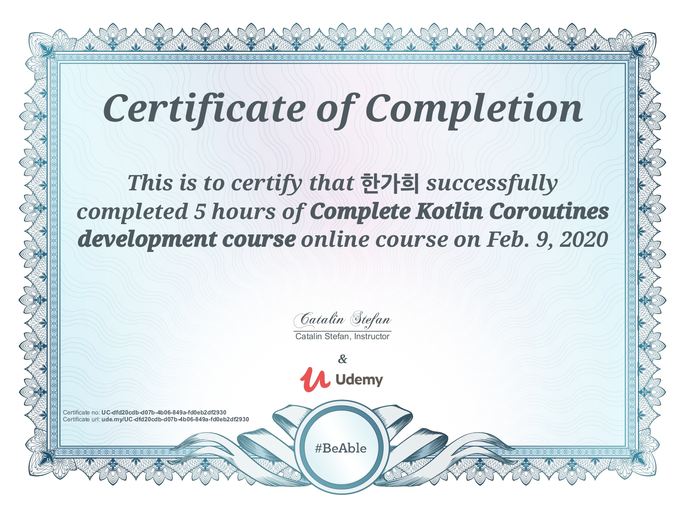

### Udemy Course

- [x]  Coroutine Basics [lecture note](./lecture-notes/Coroutine_Basics.pdf)
- [x]  Android - Image Processing [lecture note](./lecture-notes/Coroutines_and_background_image_processing_in_Android.pdf)
- [x]  Retrofit and Coroutine [lecture note](./lecture-notes/Retrofit_and_Coroutines_.pdf)
- [x]  Room and Coroutine [lecture note](./lecture-notes/Room_and_Coroutines_.pdf)
- [x]  Asynchronous Flow [lecture note](./lecture-notes/Asynchronous_Flow_.pdf)
- [x]  Android : Coroutines flow news ticker [lecture note](./lecture-notes/Android__Coroutines_flow_news_ticker.pdf)
- [x]  Channels [lecture note](./lecture-notes/Channels_.pdf)
- [x]  Concurrency and shared state [lecture note](./lecture-notes/Concurrency_and_shared_state_.pdf)